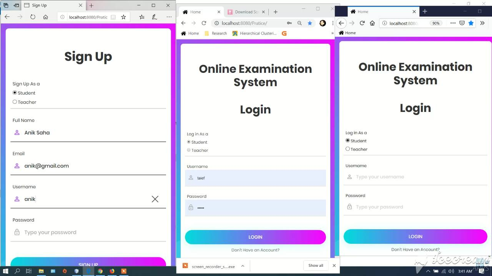
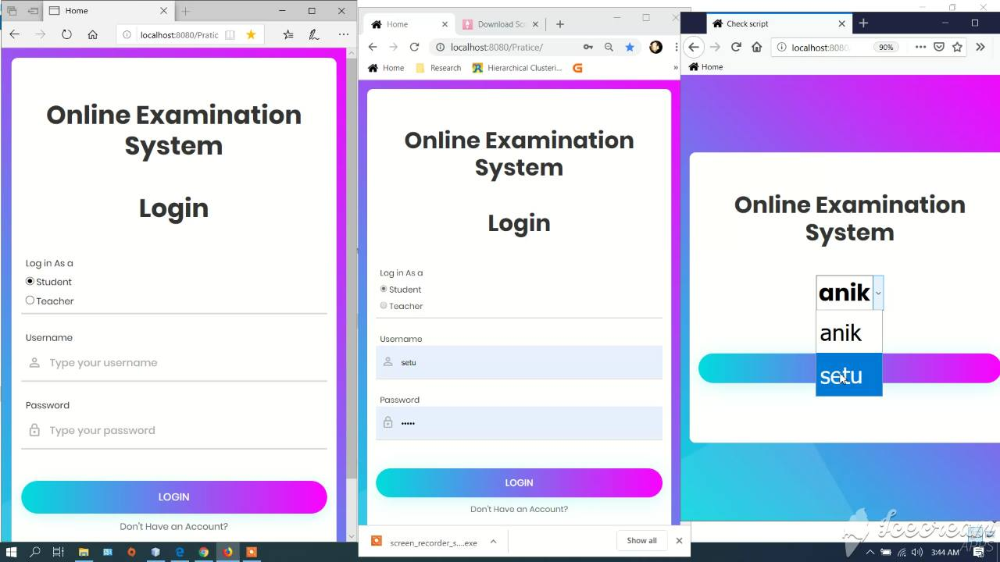
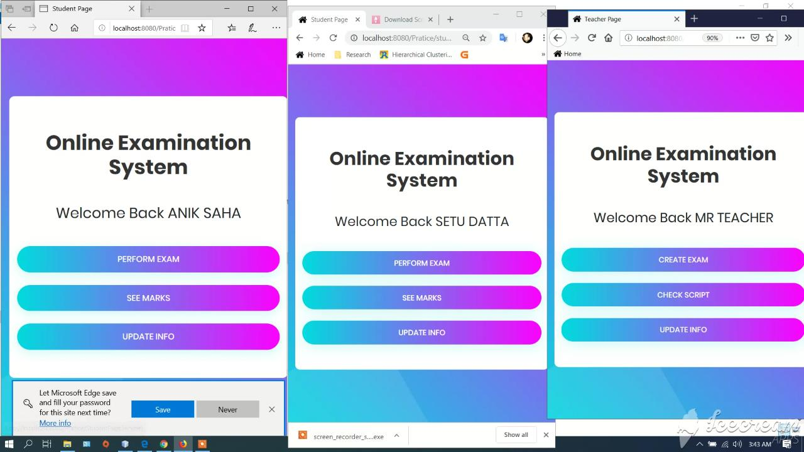
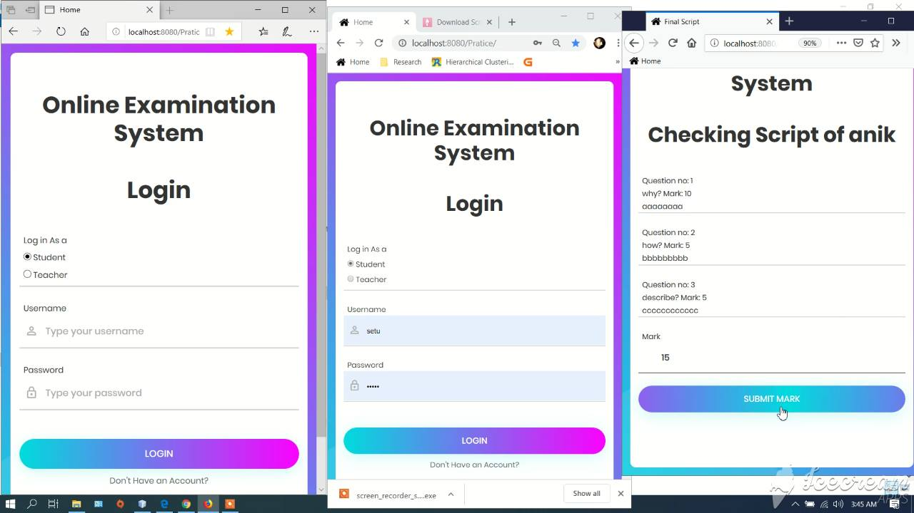
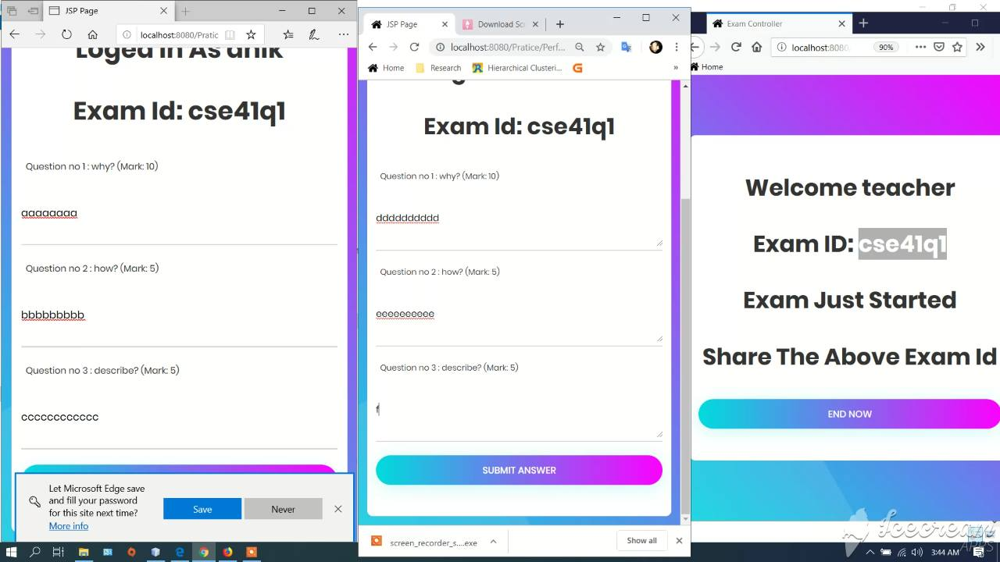

# Online-Written-Examination-System
A online based exam system made with HTML, servelet, jsp, apache server. All necessary files are in the zip file. You should use Netbean IDE to open this project.

Description : 
o	Platform : Web 
o	Language : Java,JSP 
o	Database : Java Database 
o	Core features : Login system for student,teacher and admin, teacher can create exam and can check script, student can perform exam and can see obtained mark 

